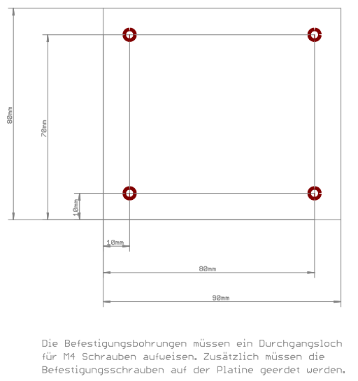
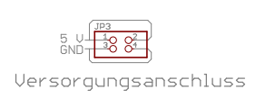
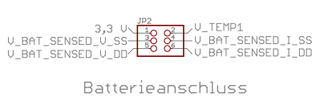
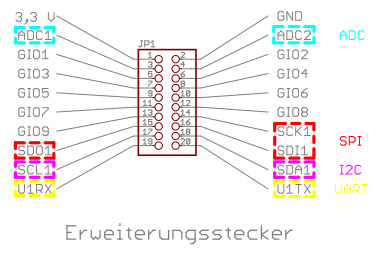

# Zusammenfassung Anforderungen

## Allgemein
* LEDme GmbH - Hersteller von stationären Leuchten
* Ausweitung des Portfolios auf mobile Leuchten in Folge von Marktanalyse und Kundenbefragung

## Kombinierte Anforderungen aus Kunden- und Firmenwunsch
* Entwicklung eines Developmentboards
* Grundlegende Aufgaben eines BMS:
    * Sicherer Betriebszustand
    * Schätzung der verbleibenden Betriebsdauer
* Integrierte Ladefunktion
* Unterbrechungsfreier Wechsel von stationär zu mobil bzw. laden zu entladen
* Kompatibilität mit bisherigen Geräten des Unternehmens
* Eine Li-Ion-Zelle für die mobile Energieversorgung
* Kompatibilität mit gängigen Zellchemien: -> definiert maximale Spannung
    * LCO
    * NMC
    * LMO
    * NCA
    * LFP
* Depth of Discharge 80 % -> definiert im Zusammenspiel mit Zellchemie die minimale Spannung
* Zelle soll während des Betriebs austauschbar sein -> *was soll das bedeuten? Ist sie das nicht automatisch?*
* Versorgung mit 5 V und maximal 1 A
* Versorgung der Erweiterungsplatinen mit 5 V 250 mA
* Es soll eine LED vorhanden sein, die in der Helligkeit gedimmt werden kann -> *Farbe ist nicht angegeben, wird aber wahrscheinlich weiß sein*
* Bauform gemäß Spezifikation für Leiterplatte

* Zweireihige 2.54 mm Stiftleisten als Schnittstelle zu Versorgung, Zelle und Erweiterungsplatinen

## Nichtfunktionale Anforderungen
* Entwicklungsprozess gemäß VDI 2206
* Möglichst lange Akkulaufzeit -> *schätze ich als nichtfunktionale Anforderung ein, da kein genauer Wert genannt ist. Die Akkulaufzeit hängt letztlich von DOD und in der Zelle maximal speicherbarer Energie ab.*
